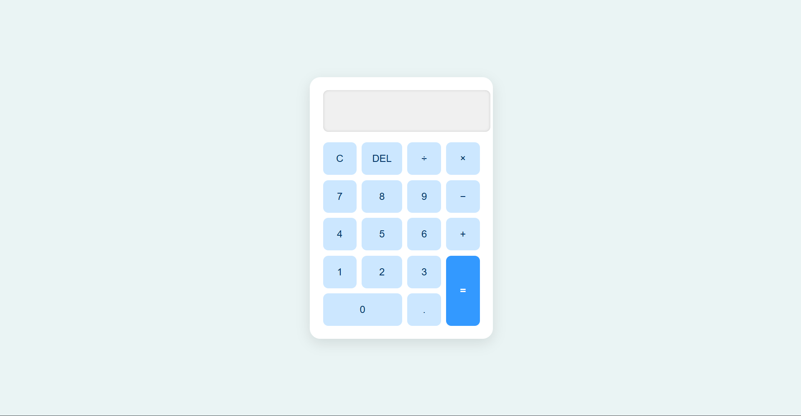

# 🔢 Calculator Web App

This is a simple calculator built using **HTML, CSS, and JavaScript** as part of my internship at CodeAlpha.

## ✅ Features

- Supports basic arithmetic operations:  
  ➕ Addition  
  ➖ Subtraction  
  ✖️ Multiplication  
  ➗ Division
- Responsive user interface
- Clear and delete buttons
- Real-time display of input and result
- **Keyboard input support**

## 📸 Screenshot

## 🚀 How to Run
1. Open `index.html` in your browser.
2. Use the buttons or keyboard to perform calculations.

---

> Project completed for CodeAlpha Internship
