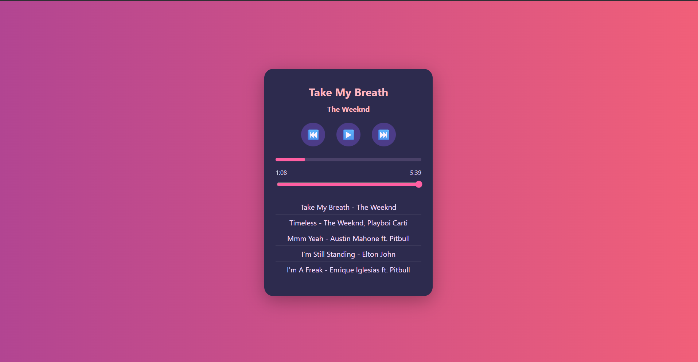

# 🎵 Music Player

A custom music player made using **HTML, CSS, and JavaScript** with custom controls and playlist support, developed during my CodeAlpha internship.

## ✅ Features

- 🎶 Play, Pause, Next, Previous functionality
- Displays:
  - 🎼 Song title
  - 👤 Artist name
  - ⏱️ Current time / Total duration
- Interactive progress bar
- Volume control slider
- Playlist of multiple songs
- Autoplay on song end

## 📸 Screenshot

## 🚀 How to Use
1. Open `index.html` in a browser.
2. Songs are located in the `songs/` folder.
3. Select from the playlist or use the player controls.

---

> Project completed for CodeAlpha Internship
